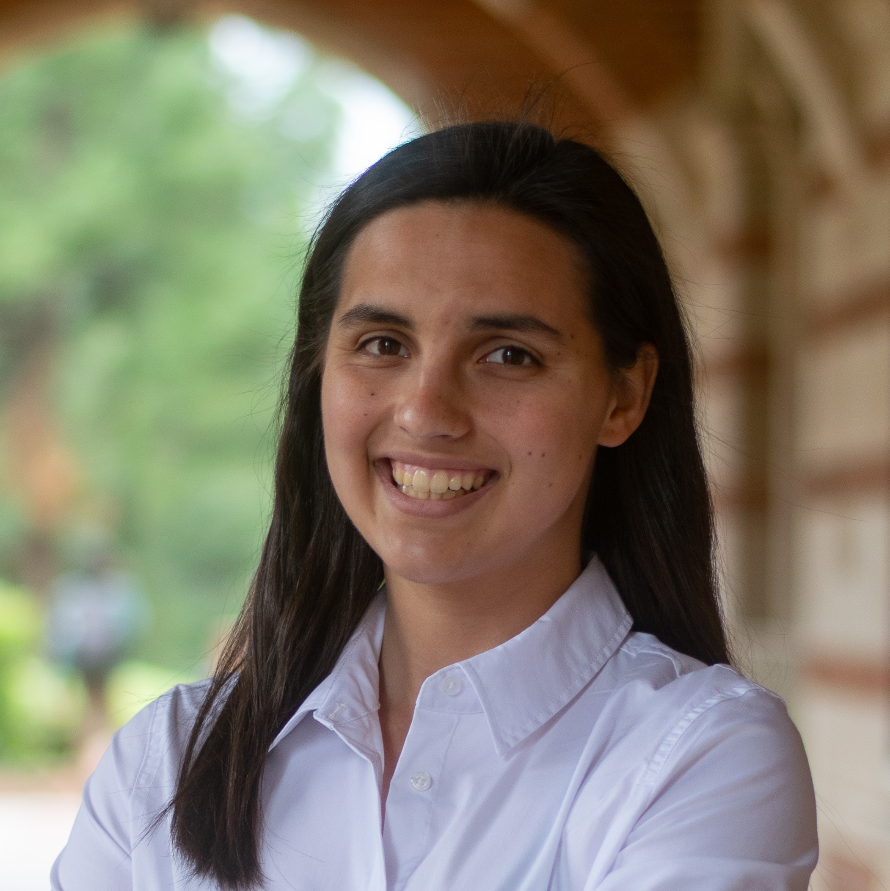

# Audrey Emis

### • Previous Azure Storage SWE Intern @ Microsoft  • ACM Cyber @ UCLA  • CS @ UCLA

My name is Audrey Emis and I'm a 4th year Computer Science student at UCLA. I am interested in vulnerability research and all kinds of cybersecurity!

This summer, I was an Azure Storage SWE intern at Microsoft, working on a RAG-based AI agent to improve productivity within my team. I am also very involved in ACM Cyber, UCLA's cybersecurity club, planning workshops and competing in CTFs.

This website is a place for me to document my projects, things I've learned, and non-technical things I'm interested in.